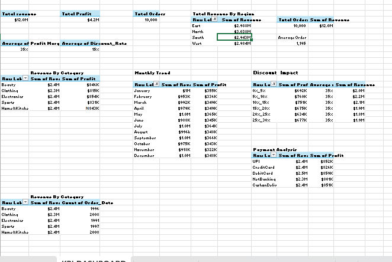

#Business Data Analytics
## Dashboard Screenshot

## KPI Pivot Table

Project Overview

This project focuses on analyzing transactional business data to uncover key insights into sales performance, profitability, customer purchasing behavior, and operational efficiency. Using Microsoft Excel, I built an interactive dashboard that helps visualize important business metrics and supports data-driven decision-making.

The analysis explores how different product categories, discounts, regions, and payment methods impact overall business performance.

⸻

🎯 Objectives

The main objectives of the project were to:
	•	Analyze revenue and profit performance across product categories
	•	Identify trends in monthly sales and profitability
	•	Evaluate the impact of discounts on profit margins
	•	Examine payment method usage and purchasing patterns
	•	Build an interactive dashboard that allows stakeholders to filter insights dynamically

⸻

🛠 Tools & Techniques Used
	•	Microsoft Excel
	•	Pivot Tables
	•	Pivot Charts
	•	Slicers for interactivity
	•	KPI metrics
	•	Data cleaning and transformation(power querry)
	•	Aggregation and trend analysis
	•	Dashboard design and visualization

⸻

📈 Key Metrics Analyzed

The dashboard highlights several important KPIs, including:
	•	Total Revenue
	•	Total Profit
	•	Total Orders
	•	Average Order Value
	•	Profit Margin (%)

These metrics provide a high-level view of the business’s financial performance.

⸻

🔍 Key Insights
insights I discovered during the analysis include:
	•	Revenue is evenly distributed across product categories, with Electronics slightly leading in profitability.
	•	The average order value is approximately $1,195, indicating relatively high-value transactions.
	•	Discount levels impact profit margins, showing the importance of balanced pricing strategies.
	•	Payment method analysis reveals how customers prefer to complete transactions.
	•	Monthly trend analysis helps identify sales patterns over time.
 📊 Dashboard Features

The Excel dashboard includes:
	•	KPI summary section
	•	Revenue by product category analysis
	•	Monthly revenue and profit trends
	•	Discount impact analysis
	•	Payment method analysis
	•	Interactive slicers for filtering data (Region, Category, Payment Method)

These elements allow users to dynamically explore the dataset and gain deeper insights.

⸻

💡 Business Value

This project demonstrates how data analysis can help businesses:
	•	Monitor performance across product categories
	•	Understand customer purchasing behavior
	•	Optimize pricing and discount strategies
	•	Improve decision-making through clear visual insights

